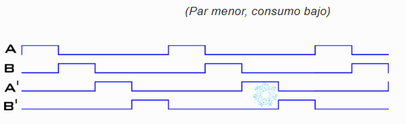
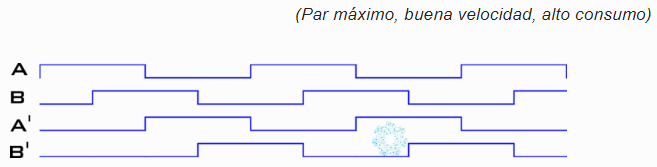

Utilizando los 4 registros match del Timer 0 y las salidas P0.0, P0.1, P0.2 y P0.3, realizar un programa en C que permita obtener las formas de ondas adjuntas, donde los pulsos en alto tienen una duración de 5 mseg. Un pulsador conectado a la entrada EINT3, permitirá elegir entre las dos secuencias mediante una rutina de servicio a la interrupción. La prioridad de la interrupción del Timer tiene que ser mayor que la del pulsador. Estas formas de ondas son muy útiles para controlar un motor paso a paso. Adjuntar el código en C .

<span style="font-size: 24px;">Secuencia 1</span>



<span style="font-size: 24px;">Secuencia 2</span>




```C
//Justin Lafay
#include "LPC17xx.h"

void confGPIO(void);
void confIntExt(void);
void confTimer(void);

int main(void){
	confGPIO();
	confIntExt();
	confTimer();
	while(1);
	return 0;

}

void confGPIO(void){
	LPC_GPIO0->FIODIR |= 0b1111; //P0.0,1,2,3,4 como salida

}

void confIntExt(void){
	LPC_PINCON->PINSEL4 |= (0b01<<26); //27:26 P2.13(EINT3) OR
	LPC_PINCON->PINSEL4 &=~ (0b10<<26); //27:26 P2.13 (EINT3) AND
	LPC_SC->EXTINT |= 0xF; //limpiar bandera de interupcion
	LPC_SC->EXTMODE |= (1<<3); //edge-sensitive mode
	LPC_SC->EXTPOLAR &=~ (1<<3); //falling-edge sensitive
	NVIC_EnableIRQ(EINT3_IRQn); //activar la interupcion externa
	return;

}

void confTimer(void){
	LPC_SC->PCONP |= (1<<1); //activar el power en timer 0 p.65
	LPC_SC->PCLKSEL1 |= (0b01<<2); //CCLK = PCLK TIMER 0
	LPC_SC->PCLKSEL1 &=~ (0b10<<2); //CCLK = PCLK TIMER 0
	LPC_TIM0->EMR &= 0; //Do nothing.
	LPC_TIM0->MR0 = 499999999; //Match value
	LPC_TIM0->MR1 = 999999999; //Match value
	LPC_TIM0->MR2 = 1499999997; //Match value
	LPC_TIM0->MR3 = 1999999999; //Match value
	LPC_TIM0->MCR |= (0b011001001001); // Interrupt on MR0,1,2,3, reset on 3.
	LPC_TIM0->TCR = 3; // Reset timer AND enable timer
	LPC_TIM0->TCR&=~ (1<<1);// remove reset timer
	return;

}

void EINT3_IRQHandler(void){
	LPC_TIM2->PR += 1;

}

void TIMER0_IRQHandler(void){
	static uint8_t seqflag = 1;
	static uint8_t seq[3] = {0b1001, 0b0011, 0b0110};
	if (seqflag == 1){
		if(LPC_GPIO0->FIOPIN & (1<<3) == 1){
			LPC_GPIO0->FIOCLR |= (0b1110);
			LPC_GPIO0->FIOSET |= 1;

		} else {
			LPC_GPIO0->FIOSET |= (LPC_GPIO0->FIOSET << 1);
		}
		seqflag = 0;
	} else {
		for (static uint8_t i = 0; i<4; i++){

		}
	}

}

```
