# ED3 - 2023

## Table of Contents

- [C Basics](#c-basics)
- [Pin Selection](#pin-selection)
- [GPIO](#gpio)
- [Power & Clock](#power--clock-selection)
- [Timer](#timer)
- [ADC](#adc)
- [DAC](#dac)

## C Basics
(*[Table of contents](#table-of-contents)*)

Put 1 at "x" position in register "r" :

```C
r |= (1<<x);
```

Put 0 at "x" position in register "r" :

```C
r &= ~(1<<x);
```

## Pin Selection

(*[Table of contents](#table-of-contents)*)

### PINSEL

Exemple of selection

```C
LPC_PINCON->PINSEL0 |= (0b01<<14);  //ADC AD0.0 PIN 0.23 OR
LPC_PINCON->PINSEL0 &= ~(0b10<<14);  //ADC AD0.0 PIN 0.23 AND
```

<div>
    <details>
    <summary>PINSEL0</summary>
    <br>
    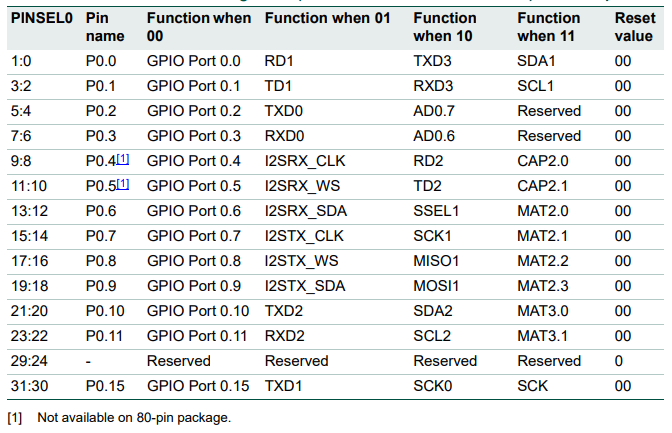
    </details>
    <details>
    <summary>PINSEL1</summary>
    <br>
    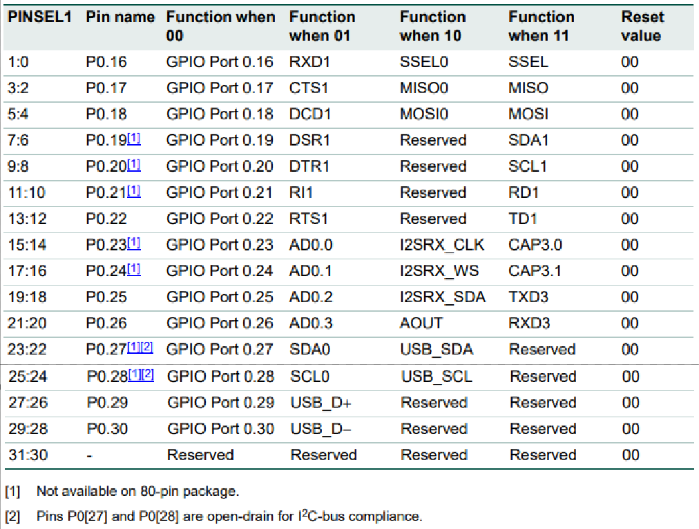
    </details>
    <details>
    <summary>PINSEL2</summary>
    <br>
    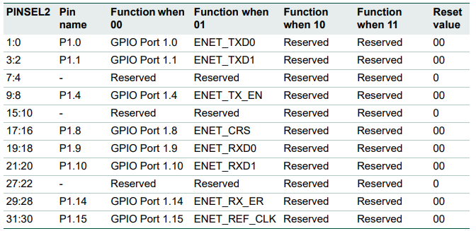
    </details>
    <details>
    <summary>PINSEL3</summary>
    <br>
    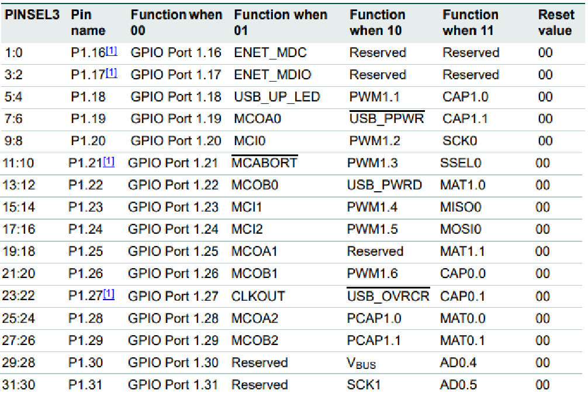
    </details>
    <details>
    <summary>PINSEL4</summary>
    <br>
    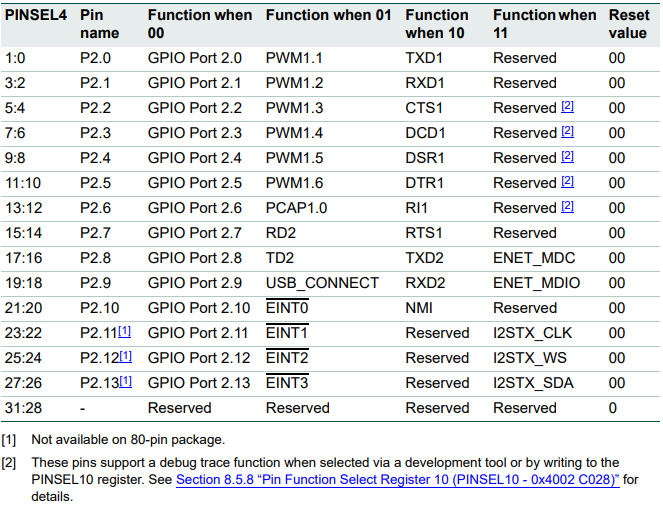
    </details>
    <details>
    <summary>PINSEL7</summary>
    <br>
    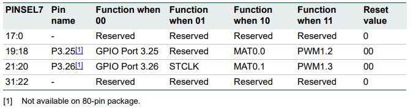
    </details>
    <details>
    <summary>PINSEL9</summary>
    <br>
    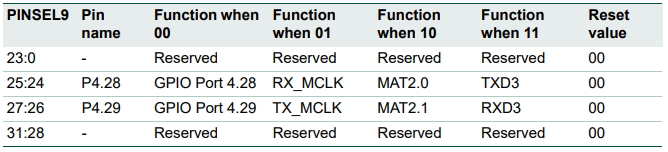
    </details>
    <details>
    <summary>PINSEL10</summary>
    <br>
    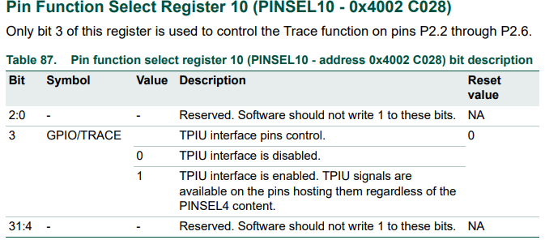
    </details>
</div>

### PINMODE

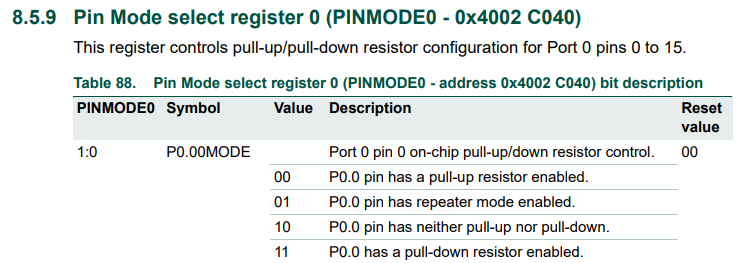

PINMODE use the same registers numbers as PINSEL, to change the targeted register, use the same position used in PINSEL.

Exemple of mode selection

```C
LPC_PINCON->PINMODE0 |= (0b10<<14);		//NEITHER PULL UP/DOWN OR
LPC_PINCON->PINMODE0 &= ~(0b01<<14);	//NEITHER PULL UP/DOWN AND
```

## GPIO

(*[Table of contents](#table-of-contents)*)

### Digital I/O ports

- Accelerated GPIO functions:
    - GPIO registers are located on a peripheral AHB bus for fast I/O timing.
    - Mask registers allow treating sets of port bits as a group, leaving other bits unchanged.
    - All GPIO registers are byte, half-word, and word addressable.
    - Entire port value can be written in one instruction.
    - GPIO registers are accessible by the GPDMA.
- Bit-level set and clear registers allow a single instruction set or clear of any number of bits in one port.
- All GPIO registers support Cortex-M3 bit-banding.
- GPIO registers are accessible by the GPDMA controller to allow DMA of data to or from GPIOs, synchronized to any DMA request.
- Direction control of individual port bits.
- All I/Os default to input with pullup after reset.

### How to setup GPIO ?

Exemple for output :

```C
LPC_GPIO0->FIODIR     |= (1<<22);

while(1){
    LPC_GPIO0->FIOCLR |= (1<<22);  // apaga el led
    LPC_GPIO0->FIOSET |= (1<<22);  // encende el led
}
```

Exemple for input :

```C
int main(void){
	uint32_t tiempo;

	LPC_GPIO0->FIODIR    |= (1<<22);
	LPC_GPIO2->FIODIR    &= ~(1<<10); //Configura el pin P2.10 como entrada
	LPC_PINCON->PINMODE4 |= (3<<20);  //Asociar resistencia de Pull-Down al pin P2.10

	while(1){
		if ((LPC_GPIO2->FIOPIN)&(1<<10)){
			tiempo = 1000000;
		}
		else{
			tiempo = 4000000;
		}
		LPC_GPIO0->FIOCLR |= (1<<22); //Apaga el led
		retardo(tiempo);
		LPC_GPIO0->FIOSET |= (1<<22); //Prende el led
		retardo(tiempo);
	}
	return(0);
}

```
### GPIO Direction :

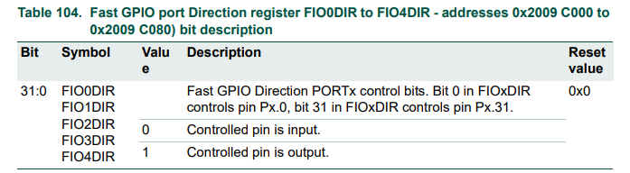

<details>
<summary>GPIO DIR list</summary>
<br>
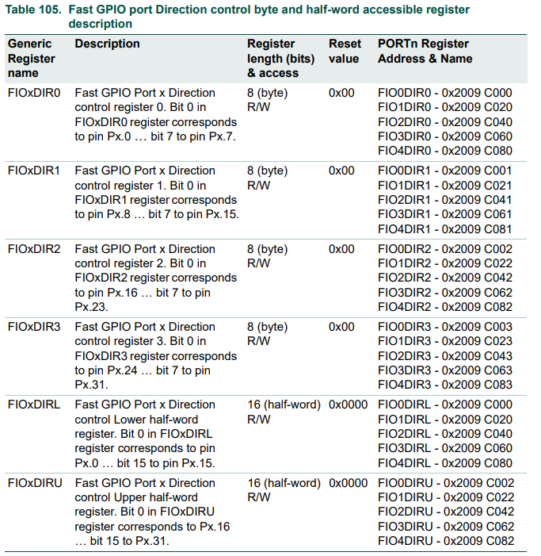
</details>

This list show starting bits and ending bits of each control register.

### GPIO Set :

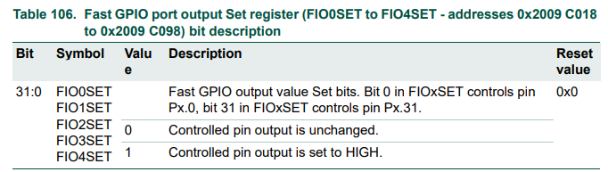

### GPIO Clear :

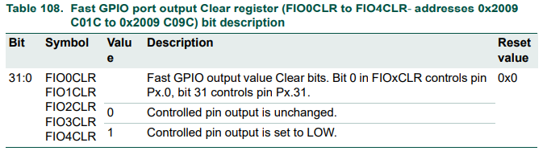

### GPIO Get value :

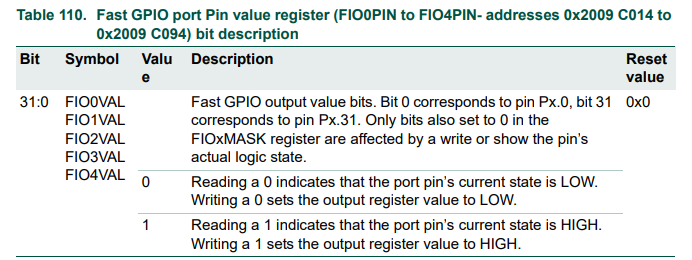

### GPIO Mask :

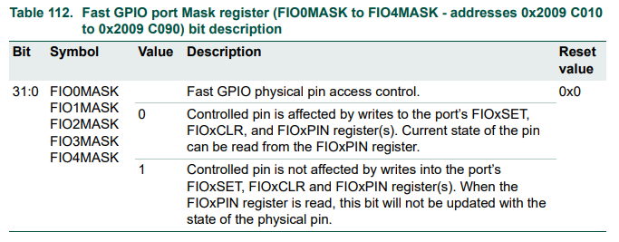

### GPIO Interrupt :

Here is an example of GPIO interrupt config :
```C
void confGPIO(void){
	LPC_GPIO0->FIODIR |= (1<<22);
	LPC_GPIO0->FIODIR &=~ (1<<15);
	return;
}
void confIntGPIO(void){
	LPC_GPIOINT->IO0IntEnR |= (1<<15); //Selecciona Interrupci�n por flanco de subida.
	LPC_GPIOINT->IO0IntClr |= (1<<15); //Limpia la bandera de interrupci�n
	NVIC_EnableIRQ(EINT3_IRQn);        // Habilita de interrupciones externas.
	return;
}
void EINT3_IRQHandler(void)
{
	if(LPC_GPIOINT->IO0IntStatR & (1<<15)){ //Pregunta si el pin P0.15 produjo la interrupci�n
		inte++;
		LPC_GPIOINT->IO0IntClr |= (1<<15); //limpia la bandera de interrupci�n
	}
	return;
}
```
#### Interrupt status registers (all GPIO) :

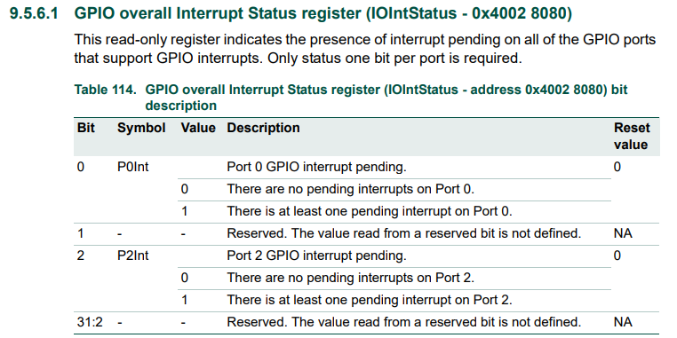

#### Interrupt set registers (rising edge) :

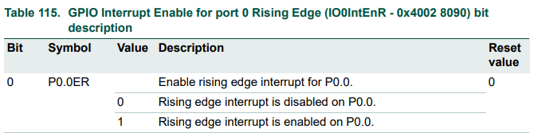

<details>
<summary>GPIO Int port 0 rising edge</summary>
<br>
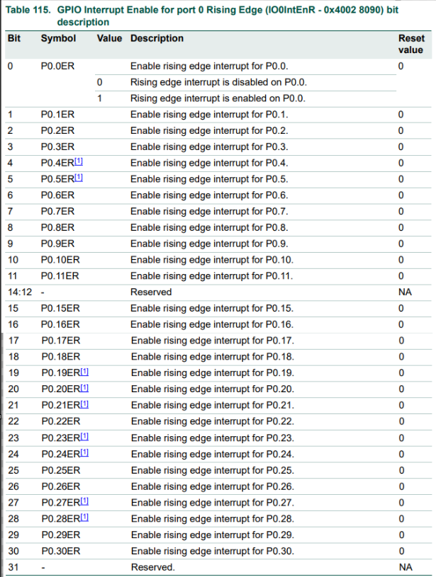
</details>
<details>
<summary>GPIO Int port 2 rising edge</summary>
<br>
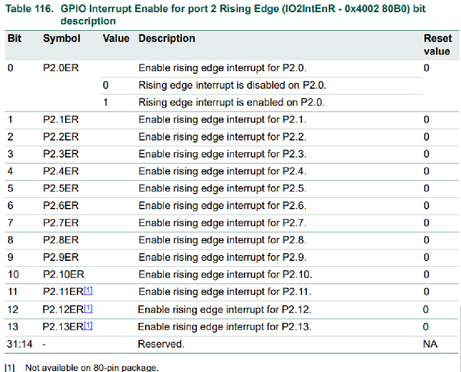
</details>

#### Interrupt set registers (falling edge) :

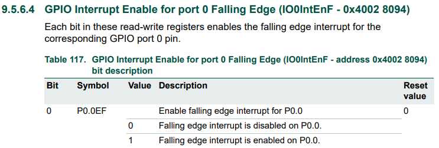
Same bit numbers for falling edge than rising edge.

#### Interrupt clear registers :

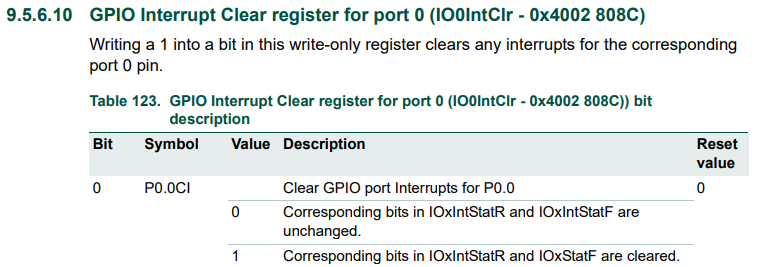
Same bit numbers for clear than rising edge.

## Power & Clock selection

(*[Table of contents](#table-of-contents)*)

<details>
<summary>Power register (PCONP)</summary>
<br>
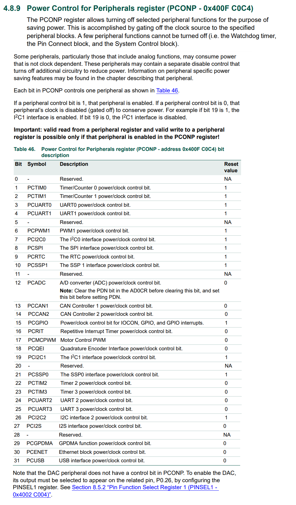
</details>
<details>
<summary>Clock register PCLKSEL0</summary>
<br>
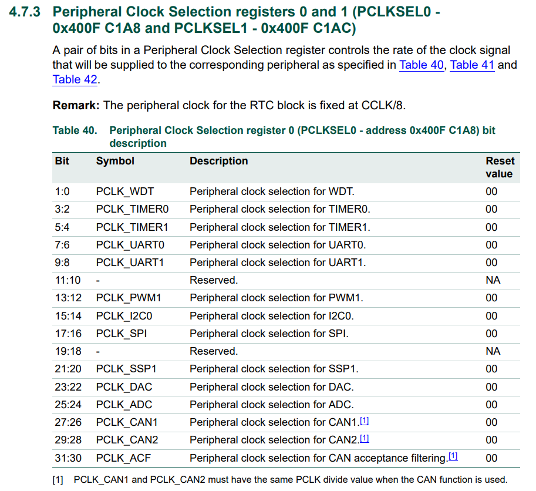
</details>
<details>
<summary>Clock register PCLKSEL1</summary>
<br>
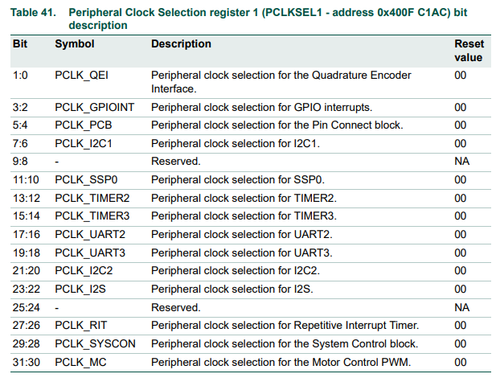
</details>

Clock selection in PCLKSEL0 and PCLKSEL1 :

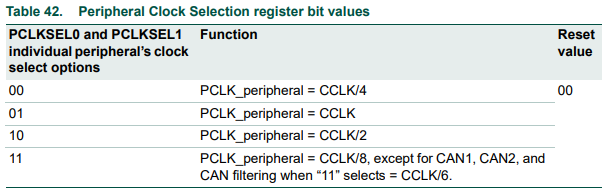

## Timer

(*[Table of contents](#table-of-contents)*)

Exemple setup of timer (mode match) :

```C
void confTimer(void){
	LPC_SC->PCONP       |= (1<<1);  // pag. 65
	LPC_SC->PCLKSEL0    |= (1<<2);  // pag. 59
	LPC_PINCON->PINSEL3 |= (3<<24); // pag. 120
	//LPC_PINCON->PINSEL7 |= (2<<18);
	LPC_TIM0->EMR       |=(3<<4);   // pag. 509
	LPC_TIM0->MR0        = 70000000;//
	LPC_TIM0->MCR       |= (1<<1);       // pag. 507
	LPC_TIM0->MCR       &= ~(1<<0);       // pag. 507
	LPC_TIM0->TCR        = 3;       // pag. 505
	LPC_TIM0->TCR       &= ~(1<<1);
	NVIC_EnableIRQ(TIMER0_IRQn);
	return;
}

void TIMER0_IRQHandler(void) //ISR del timer0
{
static uint8_t i = 0;
if (i==0){
LPC_GPIO0->FIOSET = (1<<22);
i = 1;
}
else if (i==1){
LPC_GPIO0->FIOCLR = (1<<22);
i = 0;
}
LPC_TIM0->IR|=1; //Limpia bandera de interrupci�n
return;
}
```
Other exemple setup of timer (mode capture) :
```C
void confTimer(void){

	LPC_SC->PCONP       |= (1<<1); //Por defecto timer 0 y 1 estan siempre prendidos
	LPC_SC->PCLKSEL0    |= (1<<2); // configuraci�n del clock de perif�rico
	LPC_PINCON->PINSEL3 |= (3<<20);        //pag. 120
	LPC_TIM0->CCR       |= (1<<1)|(1<<2);  //pag. 508
	LPC_TIM0->TCR        = 3;              //pag. 505
	LPC_TIM0->TCR       &= ~(1<<1);
	NVIC_EnableIRQ(TIMER0_IRQn);
	return;
}

void TIMER0_IRQHandler(void) //ISR del timer0
{
	static uint8_t i = 0;
	aux = LPC_TIM0->CR0; //Variable auxiliar para observar el valor del registro de captura

	if (i==0){
		LPC_GPIO0->FIOSET = (1<<22);
		i = 1;
	}
	else if (i==1){
		LPC_GPIO0->FIOCLR = (1<<22);
		i = 0;
	}
	LPC_TIM0->IR|=1; //Limpia bandera de interrupci�n
	return;
}
```

### Registers

<div>
    <details>
    <summary>Interrupt register (IR)</summary>
    <br>
    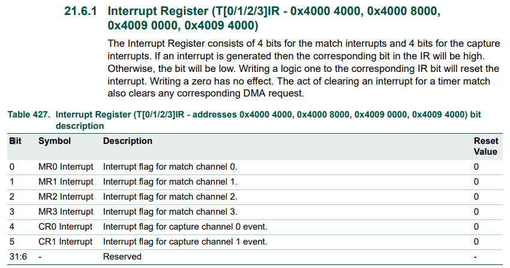
    </details>
    <details>
    <summary>Timer control register (TCR)</summary>
    <br>
    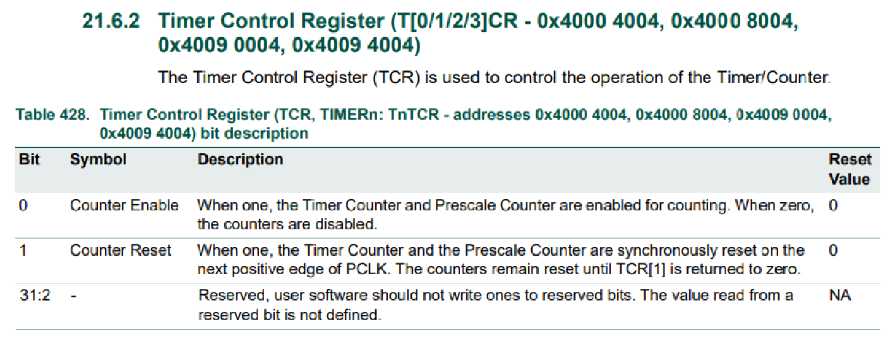
    </details>
    <details>
    <summary>Count control register (CTCR)</summary>
    <br>
    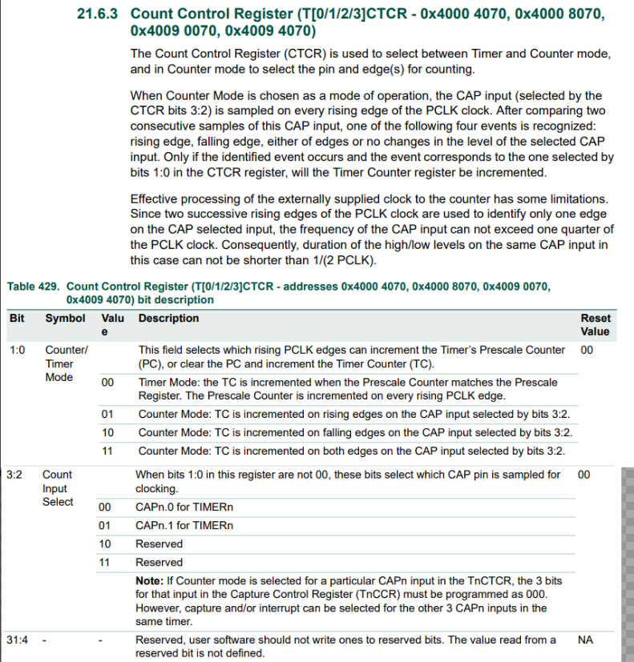
    </details>
    <details>
    <summary>Timer counter register</summary>
    <br>
    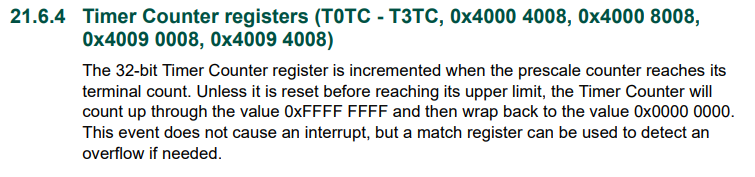
    </details>
    <details>
    <summary>Prescale register (PR)</summary>
    <br>
    
    </details>
    <details>
    <summary>Prescale timer register (PCR)</summary>
    <br>
    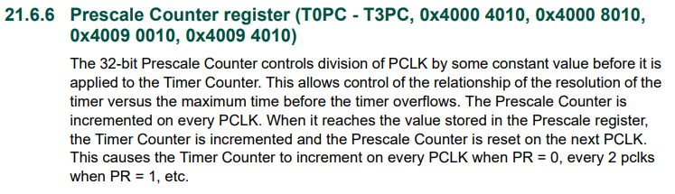
    </details>
    <details>
    <summary>Match register (MR)</summary>
    <br>
    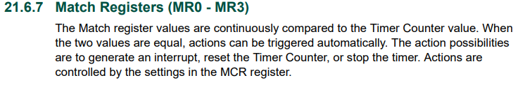
    </details>
    <details>
    <summary>Match control register (MCR)</summary>
    <br>
    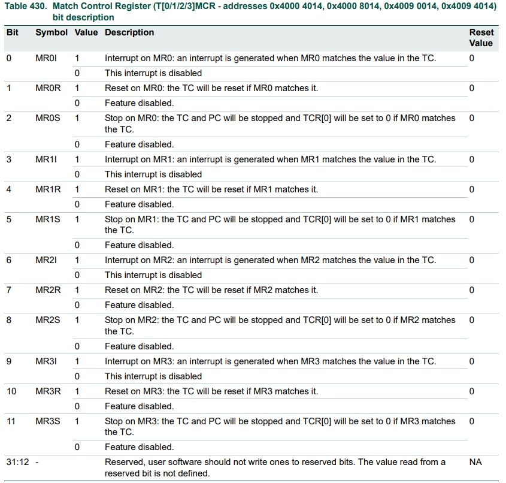
    </details>
    <details>
    <summary>Capture registers (CR)</summary>
    <br>
    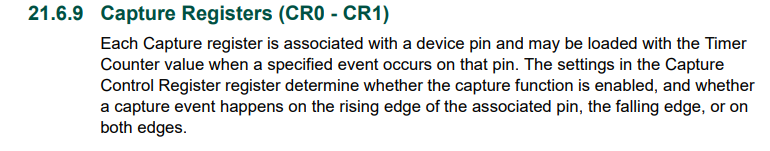
    </details>
    <details>
    <summary>Capture control registers (CCR)</summary>
    <br>
    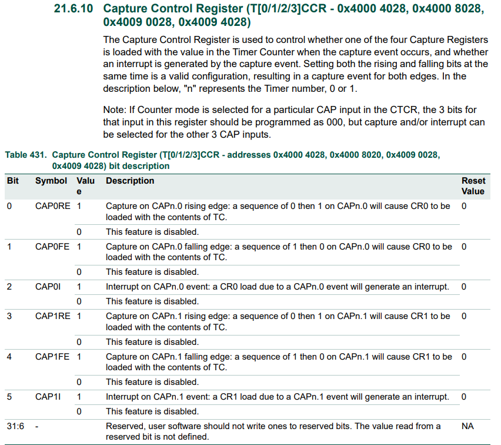
    </details>
    <details>
    <summary>External match register (EMR)</summary>
    <br>
    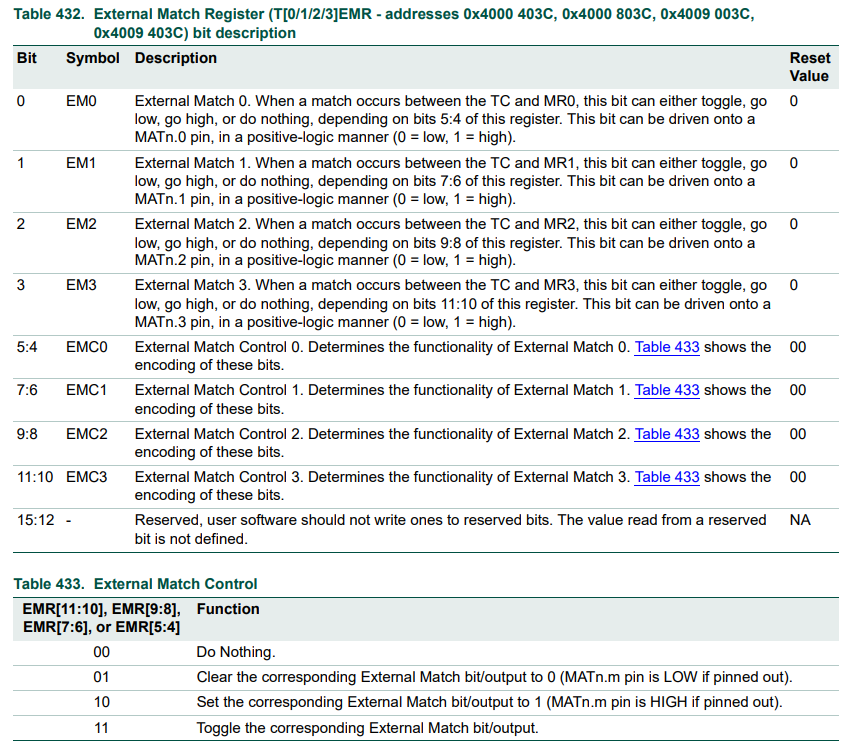
    </details>
</div>

## ADC

(*[Table of contents](#table-of-contents)*)

Exemple of setup of ADC (burst) :

```C
void confADC(void){
    LPC_SC->PCONP |= (1 << 12);
    LPC_ADC->ADCR |= (1 << 21); //habilita el ADC
    LPC_SC->PCLKSEL0 |= (3<<24);  //CCLK/8
    LPC_ADC->ADCR &=~(255 << 8);  //[15:8] CLKDIV
    //LPC_ADC->ADCR |= (1 << 0);   // channel
    LPC_ADC->ADCR |= (1 << 16);   // burst
    LPC_PINCON->PINMODE1 |= (1<<15); //neither pull-up nor pull-down.
    LPC_PINCON->PINSEL1 |= (1<<14);
    LPC_ADC->ADINTEN |= (1<<0);
    LPC_ADC->ADINTEN &=~ (1<<8);
    NVIC_EnableIRQ(ADC_IRQn);
    return;
}
void ADC_IRQHandler(void) {
    ADC0Value = ((LPC_ADC->ADDR0)>>4) & 0xFFF; //Variable auxiliar para observar el valor del registro de captura

    if (ADC0Value<2054){
        LPC_GPIO0->FIOSET = (1<<22);
    }
    else{
        LPC_GPIO0->FIOCLR = (1<<22);
    }
    return;
}
```

Other exemple of setup ADC with timer (match) :

```C
void confADC(void){
	LPC_SC->PCONP |= (1 << 12);
	LPC_ADC->ADCR |= (1 << 21);    //enable ADC
	LPC_SC->PCLKSEL0 |= (3<<24);  //CCLK/8
	LPC_ADC->ADCR &=~(255 << 8);  //[15:8] CLKDIV
	//LPC_ADC->ADCR |= (1 << 0);   // channel
	LPC_ADC->ADCR &= ~(1 << 16);   // no burst
	LPC_ADC->ADCR |= (1 << 26);    // match
	LPC_ADC->ADCR &= ~(3 << 24);   // match
	LPC_ADC->ADCR |= (1 << 27);    //edge
	//LPC_PINCON->PINSEL4 |= (1<<20);
	LPC_PINCON->PINMODE1 |= (1<<15); //neither pull-up nor pull-down.
	LPC_PINCON->PINSEL1 |= (1<<14);
	LPC_ADC->ADINTEN |= (1<<0);
	NVIC_EnableIRQ(ADC_IRQn);
	return;
}

void confTimer(void){
	LPC_SC->PCONP |= (1 << 1); //Por defecto timer 0 y 1 estan siempre prendidos
	LPC_SC->PCLKSEL0 |= (1<<2); // configuraci�n del clock del perif�rico
	//LPC_PINCON->PINSEL3 |= (3<<24);
	LPC_TIM0->EMR|=(3<<6); //toggle
	LPC_TIM0->MR1 = 100000000;
	LPC_TIM0->MCR = (1<<4); //reset on match
	LPC_TIM0->TCR = 3;      // hab y reset
	LPC_TIM0->TCR &= ~(1<<1);
	return;
}


void ADC_IRQHandler(void)
{
	static uint16_t ADC0Value = 0;
	float volt = 0;
	ADC0Value = ((LPC_ADC->ADDR0)>>4) & 0xFFF; //Variable auxiliar para observar el valor del registro de captura
	if(ADC0Value>2055)
		LPC_GPIO0->FIOSET |= (1<<9);
	else
		LPC_GPIO0->FIOCLR |= (1<<9);
	volt=(ADC0Value/4096)*3.3;
	return;
}
```

### Registers

<div>
    <details>
    <summary>ADC control register (ADCR)</summary>
    <br>
    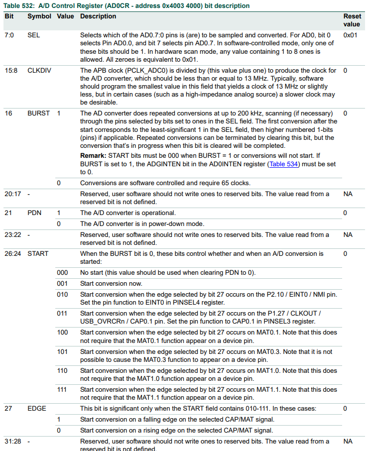
    </details>
    <details>
    <summary>ADC global data register (ADGDR)</summary>
    <br>
    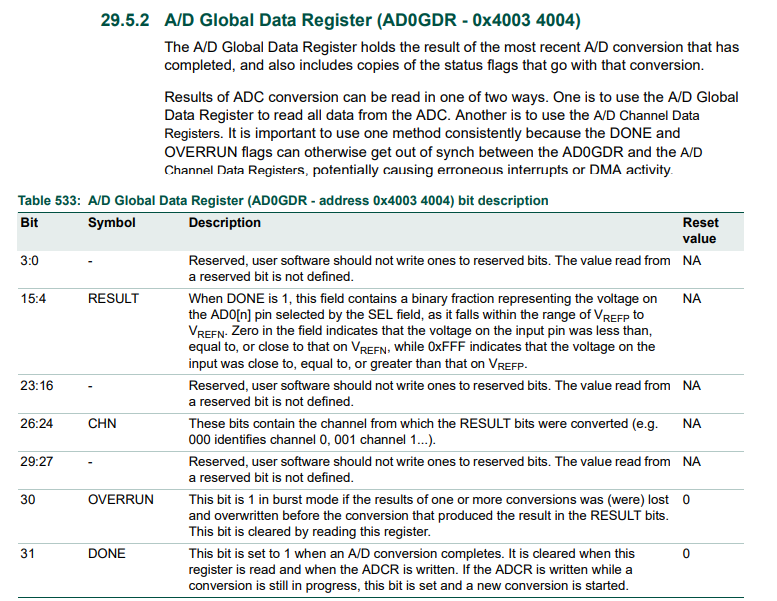
    </details>
    <details>
    <summary>ADC interrupt enable register (ADINTEN)</summary>
    <br>
    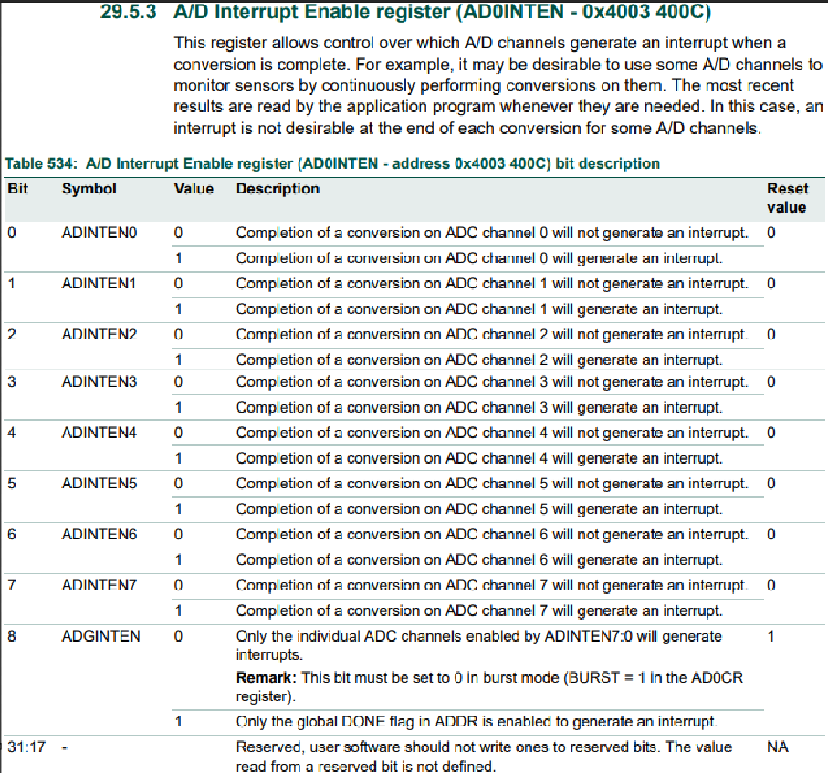
    </details>
    <details>
    <summary>ADC data registers (ADDR)</summary>
    <br>
    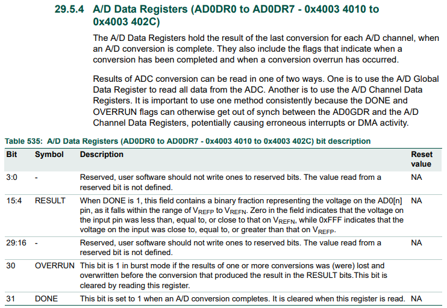
    </details>
    <details>
    <summary>ADC status register (ADSTAT)</summary>
    <br>
    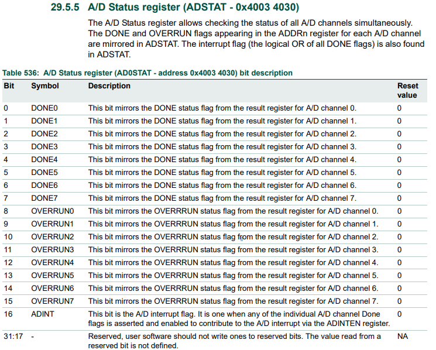
    </details>
    <details>
    <summary>ADC trim register (ADTRIM)</summary>
    <br>
    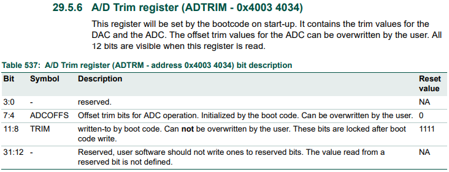
    </details>
</div>

## DAC

(*[Table of contents](#table-of-contents)*)

Exemple of setup of DAC (con driver) :

```C
#include "LPC17xx.h"
#include "lpc17xx_pinsel.h"
#include "lpc17xx_gpio.h"
#include "lpc17xx_dac.h"

void confPin(void);
void confDAC(void);
void delay(void);

int main(){
	uint32_t dac_value[11]={0,123,223,323,423,523,623,723,823,923,1023};
	confPin();
	confDAC();
	
	while(1){
		for(uint8_t conta = 0;conta<11;conta++){
			DAC_UpdateValue(LPC_DAC,dac_value[conta]);
			delay();
		}
	}
	return 0;
}
void confPin(void){
	//Configuraci�n pin P0.26 como AOUT
	PINSEL_CFG_Type pinsel_cfg;
	pinsel_cfg.Portnum = 0;
	pinsel_cfg.Pinnum = 26;
	pinsel_cfg.Funcnum = 2;
	pinsel_cfg.Pinmode = 0;
	pinsel_cfg.OpenDrain = 0;
	PINSEL_ConfigPin(&pinsel_cfg);
	return;
}
void confDAC(void){
	DAC_Init (LPC_DAC);
}
void delay(){
	for (uint32_t i=0;i<4000000;i++){}
	return;
}
```
